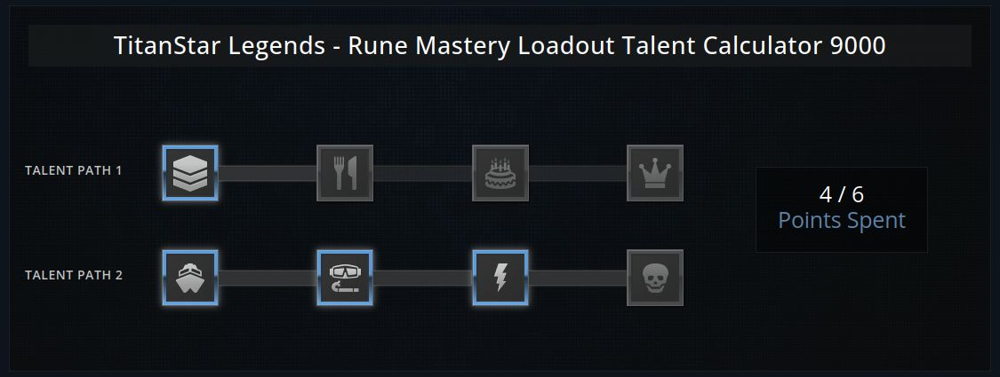

# TitanStar Legends - Rune Mastery Loadout Talent Calculator 9000



## Getting started

Run `npm install` to install the necessary packages.

Now run `npm run dev` to start your local development.

## Additional commands

```
npm run dev-lan / Identical to the 'dev' command, but exposes an IP for LAN development
npm run build / Build TitanStar Legends for deployment
npm run preview / Preview your build locally
npm run lint / Runs eslint for linting your JS
npm run format / Formats all files based on Prettier config
npm run test / Runs tests for all our components
npm run coverage / Visualizes and exposes code coverage
```

### Criteria

- Styles of submission match the provided mock (under `/public/demoImg.jpg`).
- Left click to add points.
- Right click to remove points.
- The user may only use up to 6 points.
- Each item only accounts for one point.
- Displays current point total
  - The user must select the items in order.
      -For example: The user may not put a point in the cake without first having put points in the chevrons and the silverware (in that order).


### Technology used

- [React](https://react.dev/)
- [Typescript](https://www.typescriptlang.org/)
- [React Testing Library](https://testing-library.com/docs/react-testing-library/intro/)
- [Vite](https://vitejs.dev/)
- [PostCSS](https://postcss.org/)
